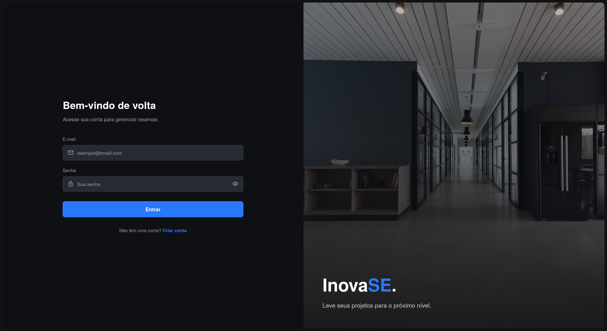
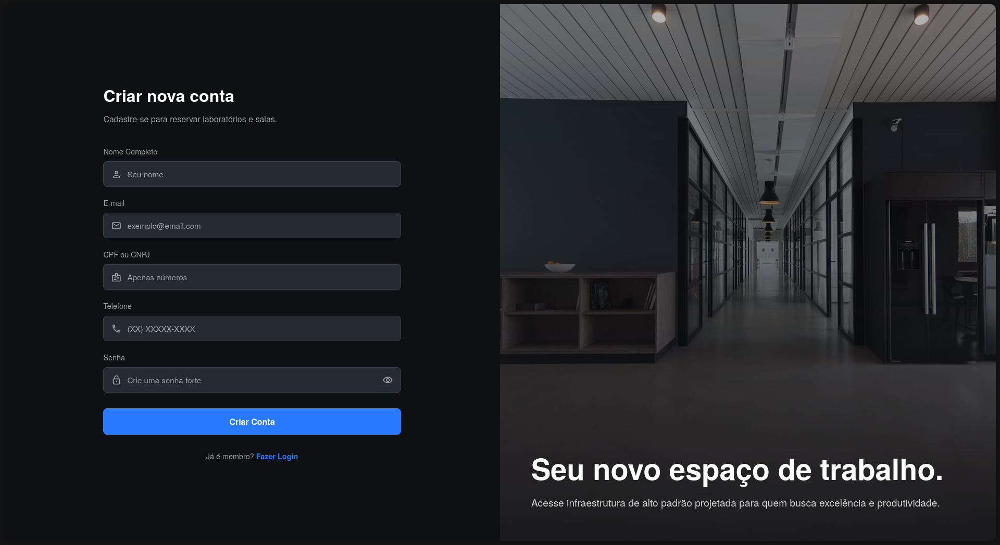
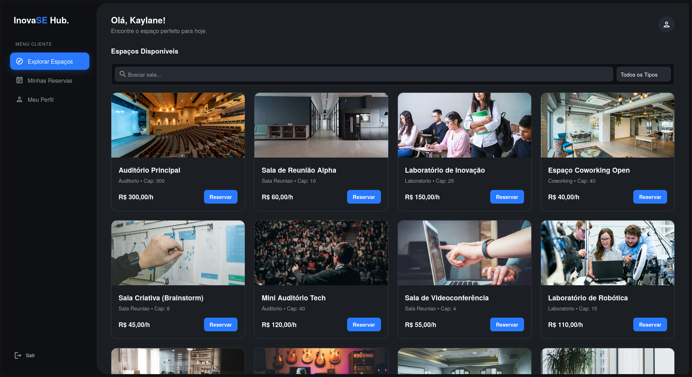
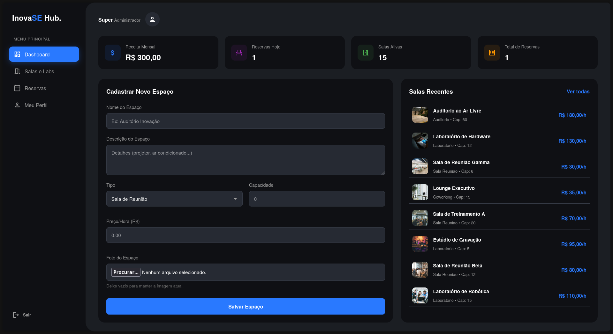

# InovaSE Hub - Sistema de Gestão de Espaços


O **InovaSE Hub** é uma plataforma web completa para gerenciamento e locação de espaços corporativos (salas de reunião, auditórios e laboratórios). O sistema permite que clientes reservem espaços e que administradores gerenciem todo o ecossistema, desde o cadastro de salas até relatórios financeiros.

---

## 1. Tecnologias Utilizadas

### BackendS
-   **Node.js & Express:** Servidor e API RESTful.
-   **MySQL:** Banco de dados relacional.
-   **Multer:** Gerenciamento de upload de imagens (armazenamento local).
-   **Bcrypt:** Criptografia de senhas (Hash).
-   **Dotenv:** Gerenciamento de variáveis de ambiente.

### Frontend
-   **HTML5 & CSS3:** Design moderno com layout fixo para Desktop.
-   **JavaScript (Vanilla):** Consumo de API via `fetch`, manipulação de DOM e modais.

---

## 2. Funcionalidades

### Módulo Cliente
-   **Explorar Espaços:** Visualização e reserva de salas com fotos, descrição e cálculo de preço automático.
-   **Reserva com Adicionais:** Possibilidade de incluir itens extras na reserva (Coffee Break, Projetor, Notebook, etc).
-   **Filtros:** Busca inteligente por nome e tipo de sala.
-   **Agendamento:** Sistema de reserva com verificação de conflito de horários (impede reserva duplicada).
-   **Histórico:** Visualização de reservas passadas e futuras, com opção de "Soft Delete" (ocultar do histórico).

### Módulo Admin
-   **Dashboard:** Visão geral com estatísticas financeiras (Receita, Total de Reservas, Salas Ativas).
-   **Gestão de Espaços (CRUD):** Criar, Editar e Excluir salas com upload de fotos.
-   **Gestão de Reservas:** Tabela completa com filtros por status, data e sala.
-   **Segurança:** Proteção contra exclusão de salas que possuem reservas ativas.

---

## 3. Como Rodar o Projeto

Siga os passos abaixo para executar o projeto em sua máquina local.

### 1. Pré-requisitos
-   Node.js instalado.
-   MySQL (Workbench ou similar) instalado.
-   Git instalado.

### 2. Clonar e Instalar
```bash

# Clone este repositório
git clone https://github.com/kaylanedias/inovase.git

# Entre na pasta
cd inovase

# Instale as dependências
npm install

``` 

### 4. Configurar o Banco de Dados

1. Abra seu gerenciador de banco de dados (MySQL Workbench, DBeaver, etc).

2. Localize o arquivo database/init.sql dentro deste projeto.

3. Copie todo o conteúdo do arquivo e execute no seu banco de dados.

- Isso criará o banco sistema_locacao, as tabelas e inserirá dados de teste.

### 5. Configurar Variáveis de Ambiente

1. Crie um arquivo chamado .env na raiz do projeto.

2. Preencha com as configurações do SEU banco de dados local:

``` 
DB_HOST=localhost
DB_USER=root
DB_PASS=sua_senha_do_mysql
DB_NAME=sistema_locacao

``` 
### 6. Iniciar o Servidor
```bash

node src/server.js

``` 

O servidor iniciará em: http://localhost:3000

### 7. Credenciais de Acesso

O banco de dados já vem populado com o usuário administrador para teste.

- Administrador (Acesso Total)

    E-mail: admin@inovase.com

    Senha: Admin@123

### 8. Estrutura do Projeto

``` 
/database       # Scripts SQL para criação do banco
/public         # Frontend (HTML, CSS, JS, Imagens)
  /css          # Estilos globais
  /js           # Lógica do Frontend (Fetch API)
  /uploads      # Fotos das salas (Armazenamento local)
/src            # Backend
  server.js     # Configuração do servidor e Rotas
  database.js   # Conexão com MySQL
.env            # Variáveis de ambiente

``` 

### 9.Segurança

O projeto implementa boas práticas de segurança:

    - SQL Injection: Uso de Prepared Statements em todas as queries.

    - Senhas: Armazenadas apenas como Hash (Bcrypt).

    - Uploads: Validação de tipo de arquivo (apenas imagens) no backend.

    - Dados Sensíveis: Credenciais de banco separadas via .env.


### Principais Screenshots

- Tela de Login


---

- Tela de Cadastro


---

- Tela Incial (cliente)- Espaços disponíveis


---

- Tela Inicial (adm) - Dashboard

